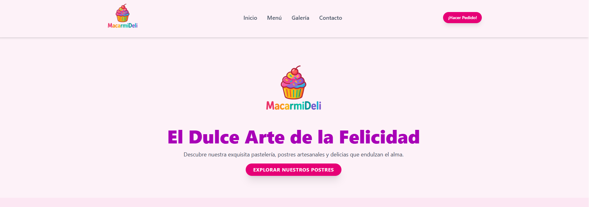

# 🧁 Macarmideli | Pastelería Artesanal Online

****

## 🚀 Sitio Web Desplegado
¡Visita el proyecto en vivo!

[https://macarmideli.netlify.app/](https://macarmideli.netlify.app/)

---

## 🍰 Descripción del Proyecto

Este proyecto es el sitio web oficial de Macarmideli, una pastelería artesanal especializada en dulces venezolanos y repostería personalizada.

El sitio sirve como escaparate digital para mostrar nuestros productos (tartas, pan de jamón, marquesas, etc.) y, lo más importante, proporciona un sistema de **Formulario de Pedidos** para que los clientes puedan solicitar encargos personalizados.

**Funcionalidades clave:**
* **Diseño Responsivo:** Adaptado para visualizarse perfectamente en móviles, tablets y escritorio.
* **Formularios Seguros:** Integración con **Formspree** para manejar de manera segura y confiable las solicitudes de Contacto y los Pedidos.
* **Enrutamiento SPA:** Navegación fluida de una sola página sin recargas completas.

---

## 🛠️ Tecnologías Utilizadas

El proyecto fue desarrollado utilizando el ecosistema de JavaScript moderno y React, optimizado por Vite.

* **Framework Principal:** **React** (Vite)
* **Lenguaje:** **TypeScript** (`.tsx`) para un código más robusto y con tipado estricto.
* **Estilos:** **Tailwind CSS** para un desarrollo rápido y flexible de estilos.
* **Despliegue (Hosting):** **Netlify**
* **Manejo de Formularios:** **Formspree** (para el backend de los formularios)
* **Control de Versiones:** **Git & GitHub**